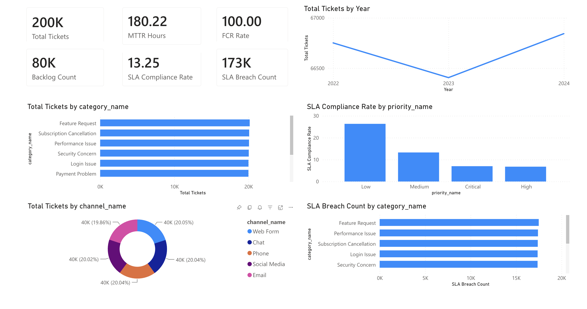

# IT Helpdesk Ticket Analytics Dashboard

A Power BI analytics solution that turns raw IT support ticket data into answers for the questions IT managers actually ask: *Are we meeting SLA targets? Where is time being lost? Is the backlog growing?*

---

## What It Is

An end-to-end pipeline — CSV → SQLite star schema → Power BI — that produces a three-page dashboard covering ticket volume, agent performance, SLA compliance, and customer satisfaction.

## How It Can Be Used

- **Track SLA health** at a glance: current compliance %, at-risk open tickets, and breach rate by category.
- **Spot bottlenecks** by comparing MTTR and MTTA across agents, priorities, and channels.
- **Manage backlog** with aging bands (0–1d, 1–3d, 3–7d, 7–14d, 14d+) to see what's getting stale.
- **Measure experience** through CSAT trends broken down by category and resolution time.
- **Plug in your own data** — the profiler auto-detects columns from any ticket CSV with fields like `created_at`, `priority`, `status`, `category`.

## Metrics

MTTR · MTTA · FCR Rate · SLA Compliance · SLA At Risk · Backlog Count · Aging Bands · CSAT

## Stack

Python · SQLite · SQL · Power BI Service · DAX (30 measures)

---

See [`documentation/powerbi_setup_guide.md`](documentation/powerbi_setup_guide.md) to build the dashboard, or [`documentation/metric_definitions.md`](documentation/metric_definitions.md) for KPI definitions.
